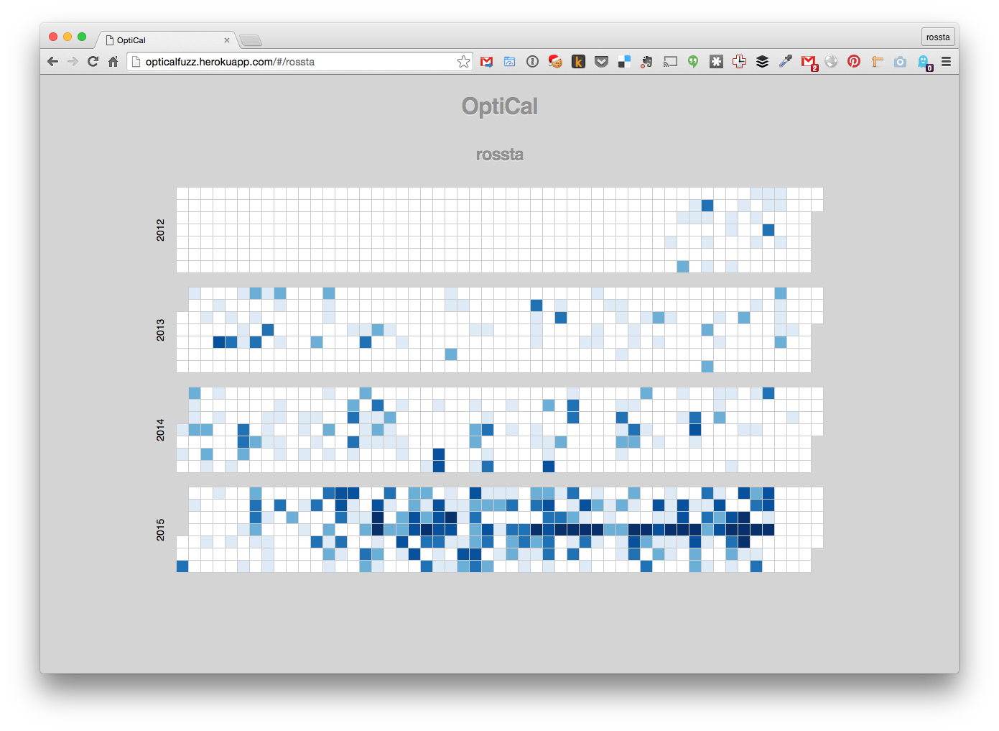

# OptiCal

A visual history of tweet frequency

Visit [OptiCal](http://opticalfuzz.herokuapp.com/) and enter a Twitter handle.

Lovingly crafted with [ember.js](http://emberjs.com/), [d3.js](http://d3js.org/), [twitter](https://github.com/sferik/twitter), and [sinatra](http://www.sinatrarb.com/).

More on [Devpost](http://devpost.com/software/optical)!
